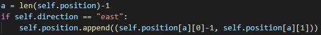
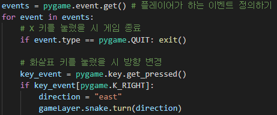
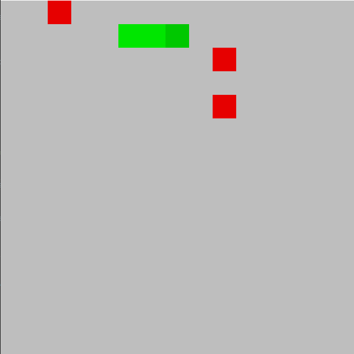
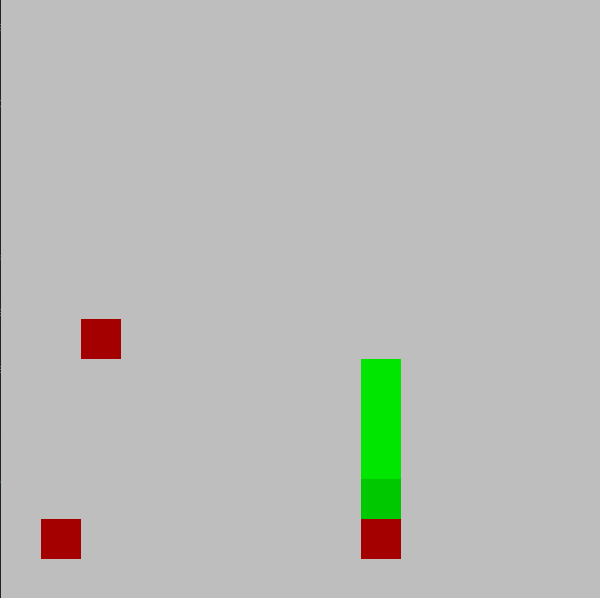
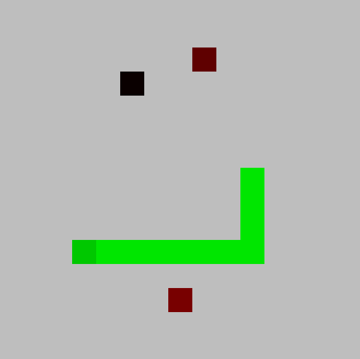
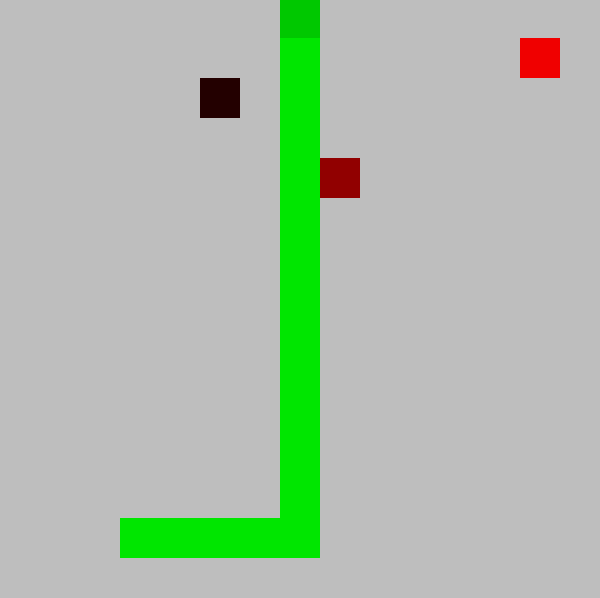

# Welcome

안녕하세요~ 이건 저의 첫번째 포스터입니다. 많이 부족하지만 재밌게 봐주셨으면 좋겠습니다.

---

**Pygame**으로 **SnakeGame**을 만드는 방법을 간단하게 설명하겠습니다.

 + 이 게임에서 가장 기본적인 요소들을 설정한다.
     - 스크린의 길이와 크기, 배경, 색깔 등

 + Snake, Apple, Gameboard, 게임 승리와 게임 오버 예외 클래스를 만든다.
     - GameOverException(게임 오버 예외), VictoryException(게임 승리 예외)

 + Snake 클래스에서 Snake의 위치를 저장할 self.position 리스트를 생성하고 self.direction 변수로 방향을 설정하는 함수와 위치를 저장한 리스트와 미리 설정한 색으로 Snake를 생성하는 함수를 만든다. 그리고 방향을 설정하는 함수와 방향을 확인하고 움직이는 함수, 그리고 성장하게 하는 함수를 만든다.
     - GRAY = 190, 190, 190 / LIME = 0, 230, 0 / GREEN = 0, 200, 0 / RED = 255, 0, 0
     - 뱀 생성 : drawRectangle(위치 튜플, 색) 함수를 이용해서 뱀의 머리 그리기
     - 뱀 성장 : Snake.position 리스트에 항목 하나 추가하기

        

        위의 그림처럼 방향을 확인하고 마지막 항목을 기준으로 위치를 새로 설정해 추가한다.

 + Apple 클래스에서도 Apple의 랜덤 위치를 저장할 self.position 리스트를 생성하는 함수와 그 리스트와 색으로 Apple을 생성하는 함수를 만든다.

 + Gameboard 클래스에서 Snake와 Apple을 생성하는 함수를 만든다. 그리고 appleReplace 함수를 만들어서 사과가 뱀에게 먹히거나 부패해서 사라지면 랜덤 위치로 사과를 생성하도록 한다.
     - 게임 승리 : 사과를 더이상 생성할 수 없을 경우, 게임 승리 예외로 게임 종료

 + Apple 클래스에서 시간이 지남에 따라 부패하는 함수를 만든다.
     - 사과의 색을 점점 어둡게 만들기

 + Gameboard 클래스에서 매 프레임마다 반복되는 함수를 만든다.
     - 뱀 움직이기
     - 사과 먹기 : 사과에 뱀이 닿았는지 확인하고 닿았으면 뱀이 성장하고 사과가 다시 생성되도록 만들기
     - 사과 부패 : 사과가 부패되면 사과를 새로 생성하기

 + while문으로 게임을 진행한다.
     - 화살표 키를 누르면 방향을 설정하고 Snake 클래스에서 turn() 함수를 사용해 뱀을 이동시킨다.

         

         위의 그림처럼 하면 된다.
     - 예외를 설정한다.

---

이렇게 게임을 만들어서 실행하면

이렇게 보일 것이다.

그리고 위의 사진처럼 뱀의 머리와 사과가 닿으면 뱀이 성장하고 사과가 사라지면서 동시에 새로 생성되도록 만들어야 한다.

사과가 부패할 때 위의 사진처럼 점점 어둡게 색이 변해야 한다.(변하는 속도는 자유)

마지막으로 뱀의 머리가 게임 스트린에 닿으면 바로 게임은 종료되도록 한다.

---

지금까지 SnakeGame 만드는 방법에 대해 간단하게 알아보았습니다. 최대한 간단하고 쉽게 설명했지만... 많이 부족할 겁니다. 그래도 재밌게 봐주시고 관심 있으신 분들은 한 번 만들어보셨으면 좋겠습니다. 읽어주셔서 감사합니다.

<https://github.com/Lynn951230/Snake_game/blob/main/snakeGame.py>

글로만 보고 이해가 어려우시다면 위 링크를 통해 제 코드를 참고하시기 바랍니다.